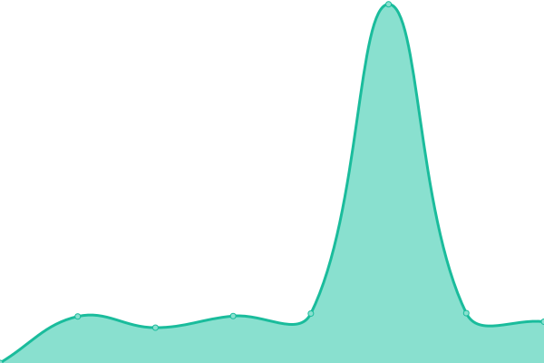
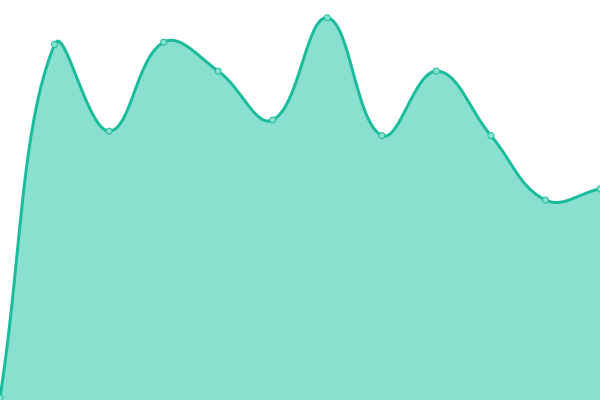

# [📈 Live Status](https://status.circlesubi.id): <!--live status--> **🟧 Partial outage**

This repository contains the open-source uptime monitor and status page for [Circles UBI](https://joincircles.net), powered by [Upptime](https://github.com/upptime/upptime).

With [Upptime](https://upptime.js.org), you can get your own unlimited and free uptime monitor and status page, powered entirely by a GitHub repository. We use [Issues](https://github.com/CirclesUBI/status/issues) as incident reports, [Actions](https://github.com/CirclesUBI/status/actions) as uptime monitors, and [Pages](https://status.circlesubi.id) for the status page.

<!--start: status pages-->
<!-- This summary is generated by Upptime (https://github.com/upptime/upptime) -->
<!-- Do not edit this manually, your changes will be overwritten -->
<!-- prettier-ignore -->
| URL | Status | History | Response Time | Uptime |
| --- | ------ | ------- | ------------- | ------ |
|  [App](https://app.circlesubi.id) | 🟩 Up | [app.yml](https://github.com/CirclesUBI/status-indonesia/commits/HEAD/history/app.yml) | 

 366ms
     
 | 

<a href="https://status.circlesubi.id/history/app">100.00%</a>
    

|  [API](https://api.circlesubi.id) | 🟩 Up | [api.yml](https://github.com/CirclesUBI/status-indonesia/commits/HEAD/history/api.yml) | 

 624ms
     
 | 

<a href="https://status.circlesubi.id/history/api">100.00%</a>
    

|  [RPC](https://rpc.circlesubi.id) | 🟩 Up | [rpc.yml](https://github.com/CirclesUBI/status-indonesia/commits/HEAD/history/rpc.yml) | 

 509ms
     
 | 

<a href="https://status.circlesubi.id/history/rpc">100.00%</a>
    

|  [Indexer](https://rpc.circlesubi.id/indexer/health) | 🟩 Up | [indexer.yml](https://github.com/CirclesUBI/status-indonesia/commits/HEAD/history/indexer.yml) | 

 306ms
     
 | 

<a href="https://status.circlesubi.id/history/indexer">72.05%</a>
    

|  [Pathfinder](https://rpc.circlesubi.id/pathfinder) | 🟥 Down | [pathfinder.yml](https://github.com/CirclesUBI/status-indonesia/commits/HEAD/history/pathfinder.yml) | 

 154ms
     
 | 

<a href="https://status.circlesubi.id/history/pathfinder">99.92%</a>
    

<!--end: status pages-->

[**Visit our status website →**](https://status.circlesubi.id)

## 📄 License

- Powered by: [Upptime](https://github.com/upptime/upptime)
- Code: [MIT](./LICENSE) © [Circles UBI](https://joincircles.net)
- Data in the `./history` directory: [Open Database License](https://opendatacommons.org/licenses/odbl/1-0/)
